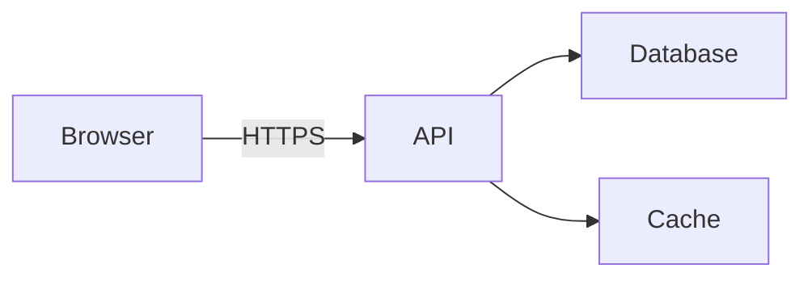

# Documentation Anti-patterns

Common mistakes and how to fix them, with generic examples drawn from a typical TypeScript/React stack.

> **Project-specific conventions** (logger import, package namespace, CLI commands) are in `docs/agents/diataxis-context.md` (written by `diataxis setup` into the consuming repo). Adapt any examples below to your project's actual stack.

---

## Tutorial Anti-patterns

### 1. Teaching Concepts Instead of Guiding Action

**Bad** (`docs/tutorials/auth.md`):

```markdown
# Understanding Authentication

Authentication is the process by which a system verifies a user's identity. This app uses
OIDC tokens issued by an external identity provider, validated server-side using JWKS…

[3 pages of theory]

Now let's set up auth in your component…
```

**Good:**

````markdown
# Add a Protected Route

In this tutorial, you'll add a route that only authenticated users can access.

## Step 1: Create the Page

Create `src/pages/Profile.tsx`:

```tsx
export const Profile = () => <h1>Profile</h1>
```
````

## Step 2: Wrap with Auth Guard

```tsx
import { ProtectedRoute } from '@/components/ProtectedRoute'

;<Route
	path="/profile"
	element={
		<ProtectedRoute>
			<Profile />
		</ProtectedRoute>
	}
/>
```

````

**Why:** Tutorials teach by doing. Move OIDC theory to `docs/explanation/auth.md`.

---

### 2. Offering Choices

**Bad:**

```markdown
## Step 3: Pick a State Library

You can use Zustand, Redux Toolkit, or Jotai. Here's how to set up each:

### Option A: Zustand …
### Option B: Redux Toolkit …
### Option C: Jotai …
````

**Good:**

````markdown
## Step 3: Add State

This project uses [state library]. Create `src/stores/counter.ts`:

```ts
// minimal example using the project's chosen state library
```
````

> See [Why we chose this state library](../explanation/why-state-library.md) for the rationale.

````

**Why:** Beginners need one path. The "why" goes in explanation; alternatives go in how-to.

---

### 3. Assuming Prior Project Knowledge

**Bad:**

```markdown
## Prerequisites

- Familiarity with our infrastructure conventions
- Understanding of the environment matrix
- Experience with our middleware stack
````

**Good:**

```markdown
## Prerequisites

- Node.js ≥ 20 and [package manager] installed
- Repo cloned and `<setup command>` completed
- 30 minutes

No prior experience with our conventions required — we'll explain as we go and link to deeper docs at the end.
```

**Why:** Tutorials are an entry point. If real prerequisites exist, link to a prerequisite tutorial.

---

## How-to Guide Anti-patterns

### 1. Explaining Concepts Instead of Showing Steps

**Bad:**

```markdown
# How to Deploy the Backend

Deployment is the process of building and pushing your code to the target environment.
This project uses [build tool]…

[2 paragraphs]

## Steps

1. Run `<build command>`
```

**Good:**

````markdown
# How to Deploy the Backend

Ship the latest backend changes to the staging environment.

> New to our deployment setup? See [Explanation: deployment architecture](../explanation/deployment.md).

## Prerequisites

- Credentials for the staging environment loaded
- `<setup command>` completed

## Steps

1. Build:
   ```bash
   <build command>
   ```
````

2. Deploy:
   ```bash
   <deploy command>
   ```

````

**Why:** How-tos are for practitioners. Link to explanation, don't recapitulate it.

---

### 2. Multiple Problems in One Guide

**Bad:**

```markdown
# How to Set Up, Configure, Deploy, and Troubleshoot the Backend
````

**Good:** Split into focused guides:

```markdown
# How to Set Up the Backend Locally

# How to Configure the Backend

# How to Deploy the Backend to Staging

# How to Troubleshoot [specific error]
```

**Why:** Users search for one task. One file = one task.

---

### 3. Raw `console.log` in Code Examples

**Bad:**

```ts
export const handler = async (event) => {
	console.log('Got event', event)
	// …
}
```

**Good:**

```ts
import { logger } from '<project-logger-import>'  // see docs/agents/diataxis-context.md

export const handler = async (event) => {
	logger.info('Got event', { event })
	// …
}
```

**Why:** Doc examples set the standard. Check `docs/agents/diataxis-context.md` for the project's logging convention.

---

## Reference Anti-patterns

### 1. Including Instructions

**Bad** (`docs/reference/feature-flags.md`):

```markdown
# Feature Flags Reference

## Adding a Flag

To add a feature flag, first open `src/lib/feature-flags.ts`, then add a new
entry to the array. Save the file and restart the backend…
```

**Good:**

````markdown
# Feature Flags Reference

## `FeatureFlag` interface

```ts
interface FeatureFlag {
	id: string
	defaultValue: boolean
	envOverrides?: Partial<Record<Environment, boolean>>
}
```
````

## Registry Location

`src/lib/feature-flags.ts`

## Current Flags

| ID                | Default | Notes |
| ----------------- | ------- | ----- |
| `enableNewSearch` | `false` | …     |

See [How to add a feature flag](../how-to/add-feature-flag.md) for setup.

````

**Why:** Reference describes; how-to instructs.

---

### 2. Inconsistent Format Across Siblings

**Bad** — three reference files, three different layouts:

```markdown
## getUser
returns user. takes id.

---

## `deleteUser(id: string): Promise<void>`
| Param | Type |
|-------|------|
| id    | string |

---

## CreateUser
creates user
````

**Good** — same shape everywhere:

````markdown
## `getUser`

```ts
function getUser(id: string): Promise<User>
```
````

| Param | Type     | Required | Description |
| ----- | -------- | -------- | ----------- |
| `id`  | `string` | Yes      | User ID     |

**Returns:** `Promise<User>`

---

## `deleteUser`

```ts
function deleteUser(id: string): Promise<void>
```

| Param | Type     | Required | Description |
| ----- | -------- | -------- | ----------- |
| `id`  | `string` | Yes      | User ID     |

**Returns:** `Promise<void>`

````

**Why:** Reference docs are scanned, not read. Consistency = scannability.

---

### 3. Hardcoded Secrets in Examples

**Bad:**

```ts
const apiKey = 'sk-prod-xxxxxxxxxxxxxxxx';
````

**Good:**

```ts
const apiKey = process.env.APP_VENDOR_API_KEY
if (!apiKey) throw new Error('APP_VENDOR_API_KEY not set')
```

**Why:** Doc examples leak into copy-paste reality. Always model the real secret-handling pattern (env vars).

---

## Explanation Anti-patterns

### 1. Being Too Abstract

**Bad:**

```markdown
# Understanding Our Architecture

The application follows modern architectural principles with a focus on scalability and
maintainability. We leverage industry best practices to ensure robust performance.
```

**Good:**

````markdown
# Understanding Our Architecture

The application is a React frontend talking to a REST API backend, with state persisted in a database.


````

We chose this structure to keep the frontend and backend independently deployable.

````

**Why:** Explanation without concrete artifacts is filler.

---

### 2. Step-by-Step Instructions in Explanation

**Bad** (`docs/explanation/event-driven.md`):

```markdown
# Understanding Event-Driven Architecture

Events let services communicate. Here's how to add one:

1. Add a queue handler in `src/handlers/events`
2. Wire it up in `src/app.ts`
3. Run `<deploy command>`
````

**Good:**

```markdown
# Understanding Event-Driven Architecture

Events let services communicate without knowing about each other.

## The Problem with Direct Calls

When the order service calls the notification service directly, it must know the
notification service's address and handle its outages.

## Events as Middleman

```

Order Service ──publish──> Queue ──consume──> Notification Handler
└──consume──> Audit Handler

```

Adding a new consumer (audit) doesn't change the producer (order).

## When We Don't Use Events

For request/response within a single feature, we use direct API calls. Eventual
consistency adds complexity, and forms need synchronous validation.

## See Also

- [How to add a queue consumer](../how-to/add-queue-consumer.md)
- [Reference: queue configuration](../reference/queue-config.md)
```

**Why:** Explanation illuminates. Implementation belongs in tutorial/how-to.

---

## Meta Anti-patterns

### 1. The Everything README

**Bad:** A single 800-line `README.md` containing install, quickstart, full API
reference, architecture rationale, contributing guide, and changelog.

**Good** — README is an index:

````markdown
# [Project Name]

[One-paragraph description.]

## Quick Start

```bash
<setup command>
```
````

## Documentation

- [Tutorials](docs/tutorials/) — Learn the basics
- [How-to Guides](docs/how-to/) — Solve specific tasks
- [Reference](docs/reference/) — APIs, configs, data models
- [Explanation](docs/explanation/) — Architecture and design

## Contributing

See [`AGENTS.md`](AGENTS.md) and [`CLAUDE.md`](CLAUDE.md).

````

---

### 2. FAQ Posing as Documentation

**Bad** (`docs/FAQ.md`):

```markdown
Q: How do I run the backend locally?
A: Run `<command>`.

Q: What's the format of the config file?
A: YAML. See …

Q: Why do we use this library?
A: We evaluated several options…
````

**Good:** Split into proper types:

- "How do I run the backend locally?" → `docs/how-to/run-backend-locally.md`
- "What's the format of the config file?" → `docs/reference/config.md`
- "Why this library?" → `docs/explanation/why-<library>.md`

FAQs almost always indicate real documentation gaps.

---

## Quick Reference

| If you find yourself…                         | You're probably…       | Instead…                                               |
| --------------------------------------------- | ---------------------- | ------------------------------------------------------ |
| Explaining concepts in a tutorial             | Mixing types           | Link to explanation                                    |
| Giving choices in a tutorial                  | Confusing beginners    | Pick one path                                          |
| Writing paragraphs in a how-to                | Teaching               | Be terse, link to explanation                          |
| Solving multiple tasks in one how-to          | Overloading            | Split into separate guides                             |
| Writing imperative steps in reference         | Instructing            | Link to how-to                                         |
| Inconsistent format across reference siblings | Being sloppy           | Adopt the established template                         |
| Being abstract in explanation                 | Being unhelpful        | Add concrete examples and diagrams                     |
| Writing implementation steps in explanation   | Wrong type             | Link to tutorial / how-to                              |
| Using `console.log` in code examples          | Setting a bad standard | Use project logger (see `docs/agents/diataxis-context.md`) |
| Inlining secrets in code samples              | Leaking by example     | Use `process.env.X` and reference secret-handling docs |
