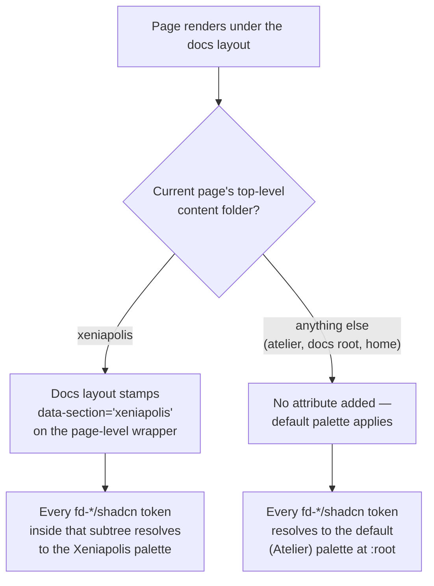

# About section theming

Why does this site render in two different color palettes depending on which content section you're browsing, and how does a component author make sure their component picks up the right one automatically?

## Background

This site has two identities layered on one Next.js app: **Atelier für Innovationen**, this site's own brand (its default look, applied to the home page, shared chrome, the Atelier content section, and the docs root), and **Xeniapolis**, the content section republishing the outside Xenia research concept, which gets its own distinct look. The decision to give Xeniapolis a full-page override rather than a single accent color is recorded in [ADR-0002](../adr/0002-per-section-theming.md).

## The core mechanism: two token sets, one variable name each

Every component in this site styles through Fumadocs' `fd-*` design tokens (or, since the shadcn preset swap, the shadcn-convention names those tokens alias to — `bg-fd-card`, `text-fd-muted-foreground`, and so on). Those Tailwind utility classes all resolve, at the CSS level, through a small set of custom properties: `--background`, `--primary`, `--card`, `--sidebar`, and so on.

The default (Atelier) palette defines those custom properties at `:root`. The Xeniapolis palette redefines the _same_ custom property names, but scoped under a `[data-section="xeniapolis"]` attribute selector (and its dark-mode compound, since each palette has its own light and dark variant). CSS custom property scoping does the rest: any element inside a subtree carrying `data-section="xeniapolis"` resolves `--primary` (and every other token) to the Xeniapolis value instead of the root default, purely through normal cascade — no component re-renders, no JavaScript theme-switching logic, no per-component prop.

The `data-section` attribute is derived the same way the docs layout already derives which top-level content folder a sidebar tab belongs to: `source.getNodeMeta()` plus `PathUtils.dirname()`. That existing pattern was extended to run per-current-page (via the docs layout's own route `params`), not just across the static tab list.

## Why this needed a full-page wrapper, not just the content area

The attribute is applied high enough in the docs layout tree to wrap shared chrome (nav, sidebar, footer) as well as the article body. If it only wrapped the content slot, a Xeniapolis page would render with a re-themed article inside an unchanged, still-Atelier-colored nav and sidebar — which reads as a bug, not an intentional section identity. See the "Alternatives Considered" table in [ADR-0002](../adr/0002-per-section-theming.md) for why a content-only scope, and separately why per-section Next.js route layouts, were both rejected in favor of this single attribute.

## The tab-switcher is deliberately independent of this

The sidebar's section switcher (the UI that lets you jump between Atelier and Xeniapolis) has its own, separate coloring mechanism: `--atelier-color` and `--xeniapolis-color`, read by the docs layout's tab-icon transform. These are set once, at `:root`, to each palette's `--primary` value — **not** inside the `[data-section="xeniapolis"]` scope. This is intentional: the switcher needs to show both section's identifying colors _simultaneously_, regardless of which page you're currently on. If these variables were scoped the same way the full-page palette is, every icon in the switcher would just inherit whichever palette the current page happens to be in, and you'd lose the at-a-glance cue for where each tab leads.

## What a new component needs to do

Nothing, in the common case. Any component that styles exclusively through `fd-*`/shadcn Tailwind utility classes (which is the established convention across this codebase — see the `docs/reference/fumadocs/` standards) inherits whichever palette is active in its DOM position automatically, because the underlying CSS custom properties are what carry the section-scoping, not any React state or context.

The only time this needs deliberate handling is a component that hardcodes a color instead of going through a token (a mistake to fix regardless of theming), or a component that needs to render the _other_ section's color deliberately — as the tab-switcher does, by reading `--atelier-color`/`--xeniapolis-color` directly rather than the ambient `--primary`.

## A third section

This mechanism generalizes to a third top-level content section in principle — the same `data-section` attribute and a third scoped selector — but that is explicitly not something to add speculatively. [ADR-0002](../adr/0002-per-section-theming.md) covers exactly two sections; a third needs its own decision about whether it deserves a distinct identity at all before reaching for this pattern again.

## Further Reading

- [ADR-0002: Per-section theming via CSS custom-property scoping](../adr/0002-per-section-theming.md)
- [ADR-0001: Adopt @fumadocs/base-ui over fumadocs-ui (Radix UI)](../adr/0001-adopt-fumadocs-base-ui.md)
- [Domain glossary](../reference/glossary.md) — for what "Atelier für Innovationen" and "Xeniapolis" mean as concepts, not just as CSS scopes
